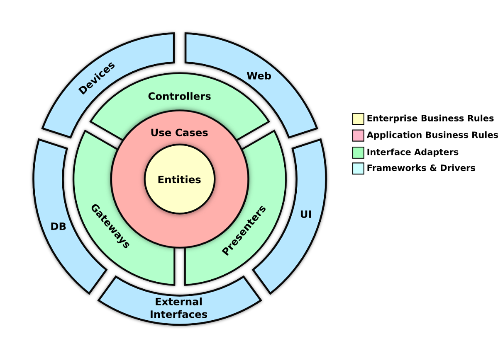

# API de Validação de Senhas

Esta é uma API desenvolvida com Spring Boot Java, utilizando princípios de Clean Architecture. 
O principal objetivo desta API é fornecer um caso de uso para a validação de senhas com regras específicas de segurança.

## Estrutura do Projeto

A estrutura do projeto é organizada em pacotes que seguem os princípios da Clean Architecture:



com.itau.backend.challenge.demo 
├── app 
│ ├── exceptions # Exceções personalizadas para validação 
│ └── usecases # Casos de uso da aplicação
│
├── config # Configurações da aplicação
└── controllers # Controladores da API
  └── dtos # DTOs para requisições e respostas


## Caso de Uso: `ValidatePasswordUseCase`

A classe `ValidatePasswordUseCase` é responsável por validar senhas com as seguintes regras:

- A senha não deve ser nula ou vazia.
- Deve conter no mínimo 9 caracteres.
- Deve conter pelo menos 1 dígito.
- Deve conter pelo menos 1 letra minúscula.
- Deve conter pelo menos 1 letra maiúscula.
- Deve conter pelo menos 1 caractere especial, dentre eles: !@#$%^&*()-+
- Não deve conter espaços em branco.
- Não deve ter caracteres repetidos.

### Exceções

As seguintes exceções personalizadas são lançadas em caso de falha na validação:

- `EmptyPasswordException`: Lançada quando a senha é nula ou vazia.
- `PasswordMinimumCharactersException`: Lançada quando a senha não atende ao número mínimo de caracteres.
- `PasswordMinimumDigitsException`: Lançada quando não há dígitos na senha.
- `PasswordMinimumLowerLettersException`: Lançada quando não há letras minúsculas na senha.
- `PasswordMinimumUpperLettersException`: Lançada quando não há letras maiúsculas na senha.
- `PasswordMinimumSpecialCharactersException`: Lançada quando não há caracteres especiais na senha.
- `PasswordBlankSpaceException`: Lançada quando a senha contém espaços em branco.
- `PasswordRepeatedCharactersException`: Lançada quando a senha contém caracteres repetidos.

## Controlador: `PasswordController`

O `PasswordController` fornece um endpoint para validar senhas:

### Endpoint: `POST /password/validate`

- **Requisição**: Aceita um corpo JSON com o DTO `ValidatePasswordRequestDto`, que deve conter a senha a ser validada.
- **Resposta**:
    - **200 OK**: Retorna um DTO `ValidatePasswordResponseDto` com o status da validação e uma mensagem.
    - **400 Bad Request**: Retorna uma mensagem de erro se a validação falhar.

#### Exemplo de Requisição

POST /password/validate
Content-Type: application/json
```json
{
  "password": "SuaSenha@123"
}
```

#### Exemplo de Requisição

* Sucesso:

```json
{
  "valid": true,
  "message": "Senha válida"
}
```

* Falha:

```json
{
  "valid": false,
  "message": "A senha deve conter pelo menos 1 caractere especial"
}
```

### Como Executar

* Clone o repositório:
```console
git clone <URL_DO_REPOSITORIO>
cd <NOME_DO_DIRETORIO>
```

* Compile o projeto:
```console
./mvnw clean install
```

* Execute a aplicação:
```console
./mvnw spring-boot:run
```
