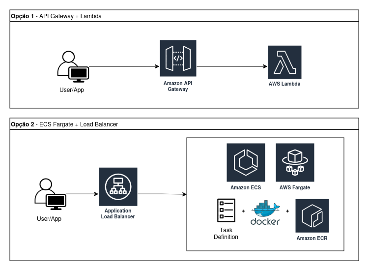

# API de Validação de Senhas

Esta é uma API desenvolvida com Spring Boot Java, utilizando princípios de Clean Architecture. 

O principal objetivo desta API é fornecer um caso de uso para a validação de senhas com regras específicas de segurança.

## Estrutura do Projeto

A estrutura do projeto é organizada em pacotes que seguem os princípios da Clean Architecture:


com.itau.backend.challenge.demo 

```
├── app 
│ ├── exceptions # Exceções personalizadas para validação 
│ └── usecases # Casos de uso da aplicação
│
├── config # Configurações da aplicação
└── controllers # Controladores da API
  └── dtos # DTOs para requisições e respostas
```

## Caso de Uso: `ValidatePasswordUseCase`

A classe `ValidatePasswordUseCase` é responsável por validar senhas com as seguintes regras:

- A senha não deve ser nula ou vazia.
- Deve conter no mínimo 9 caracteres.
- Deve conter pelo menos 1 dígito.
- Deve conter pelo menos 1 letra minúscula.
- Deve conter pelo menos 1 letra maiúscula.
- Deve conter pelo menos 1 caractere especial, dentre eles: !@#$%^&*()-+
- Não deve conter espaços em branco.
- Não deve ter caracteres repetidos.

### Exceções

As seguintes exceções personalizadas são lançadas em caso de falha na validação:

- `EmptyPasswordException`: Lançada quando a senha é nula ou vazia.
- `PasswordMinimumCharactersException`: Lançada quando a senha não atende ao número mínimo de caracteres.
- `PasswordMinimumDigitsException`: Lançada quando não há dígitos na senha.
- `PasswordMinimumLowerLettersException`: Lançada quando não há letras minúsculas na senha.
- `PasswordMinimumUpperLettersException`: Lançada quando não há letras maiúsculas na senha.
- `PasswordMinimumSpecialCharactersException`: Lançada quando não há caracteres especiais na senha.
- `PasswordBlankSpaceException`: Lançada quando a senha contém espaços em branco.
- `PasswordRepeatedCharactersException`: Lançada quando a senha contém caracteres repetidos.

## Controlador: `PasswordController`

Fornece um endpoint para validar senhas:

### Endpoint: `POST /password/validate`

- **Requisição**: Aceita um corpo JSON com o DTO `ValidatePasswordRequestDto`, que deve conter a senha a ser validada.
- **Resposta**:
    - **200 OK**: Retorna um DTO `ValidatePasswordResponseDto` com o status da validação e uma mensagem.
    - **400 Bad Request**: Retorna uma mensagem de erro se a validação falhar.

### Exemplo de Requisição

POST /password/validate

Content-Type: application/json
```json
{
  "password": "SuaSenha@123"
}
```

### Exemplo de Resposta

* Sucesso:

```json
{
  "valid": true,
  "message": "Senha válida"
}
```

* Falha:

```json
{
  "valid": false,
  "message": "A senha deve conter pelo menos 1 caractere especial"
}
```

### Como Executar

* Clone o repositório:
```console
git clone https://github.com/giuliarrocha/itau-backend-challenge.git
```

* Execute a aplicação:
```console
./mvnw clean package
./mvnw spring-boot:run
```

## Infraestrutura AWS
Há algumas formas nas quais essa aplicação pode ser provisionada na AWS.
Alguns pontos como número de recursos, volume de tráfego, custos e requisitos específicos da aplicação podem impactar 
na escolha.

Abaixo elenco duas opções principais para o provisionamento desta aplicação:



### Opção 1: API Gateway + Lambda
- O usuário ou aplicação cliente realiza uma requisição HTTP ao Amazon API Gateway com as credenciais de acesso 
necessárias. O API Gateway gerencia as chamadas de requisições simultâneas, inclusive gerenciamento de tráfego, 
suporte de CORS, controle de autorização e acesso, com fluxo controlado, monitoramento e gerenciamento de versões da API;
- Para validação dessas credenciais pode ser necessário a introdução de outro serviço como Amazon Cognito, um servidor 
de autenticação e de autorização para tokens e AWS credenciais de acesso OAuth 2.0;
- A API Gateway aciona a aplicação servless lambda, executando o código de validação de senha;
- Nesse caso, a arquitetura utilizada neste projeto permite a extração apenas da classe `ValidatePasswordUseCase`, 
sem o acoplamento do framewwork Spring Boot.

#### Vantagens
- Lambda possui integração direta com API Gateway, sem necessidade de configuração de frameworks como Java Spring Boot 
para receber requisições;
- Menor custo para menor número de requisições;
- Escalabilidade;
- Menor número de recursos para provisionar e gerenciar.

#### Desvantagens
- Pequeno atraso nas primeiras execuções da lambda se ela não for chamada com frequência;
- Não é ideal para aplicações que exija muitas dependências, maior tempo de execução e maior número de responsabilidades.

### Opção 2 ECS Fargate + Load Balancer
- Exige a containerização da aplicação no ECR, com utilização do framework Java Spring Boot;
- Load Balancer é responsável por receber a requisição HTTP/HTTPs do cliente e distribuir o tráfego/carga entre as 
instâncias Fargate localizadas em um service do ECS, onde ocorrerá a execução do endpoint;
- A validação das credenciais do cliente ocorre dentro da própria aplicação Docker.

#### Vantagens
- Permite aplicações com maior número de dependências e com maior tempo de execução, além de permitir maior
complexidade para aplicação  (escalabilidade horizontal);
- Não há latência na execução visto que a aplicação está sempre rodando.

#### Desvantagens
- Maior custo para menor número de requisições;
- Maior gerenciamento de recursos, gerenciamento de container (configuração da imagem, cpu, memória, etc);
- Pode existir a necessidade de um serviço para escalabilidade.

### Conclusão
Como se trata de uma aplicação simples, de baixa complexidade, fácil manutenção e rápida execução, a opção 1 
(API Gateway + Lambda) seria a melhor opção se o requisito for disponibilidade considerável, que permite os 
pequenos atrasos que a lambda pode gerar. A opção 2 (ECS Fargate + Load Balancer) seria viável apenas caso seja 
necessário um número massivo de requisições e alta disponibilidade, sem permissão de pequenos atrasos na resposta.